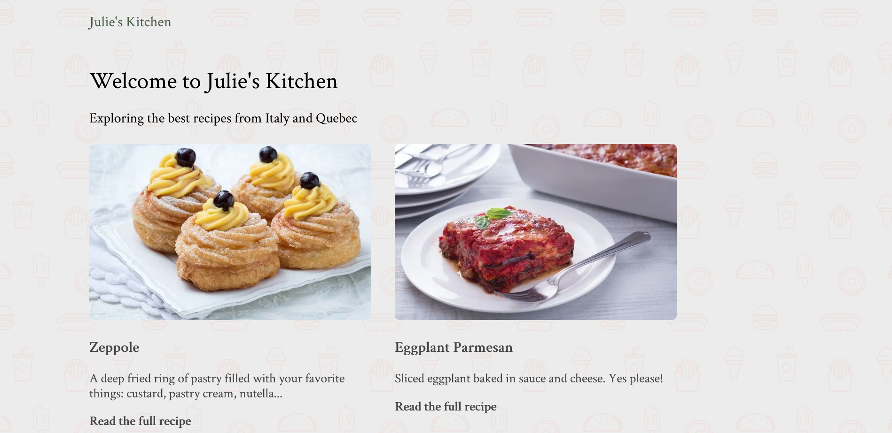

# Next.js Recipe App

A recipe app built with [Next.js](https://nextjs.org/) and [Sanity.io](https://www.sanity.io/), based on Kapehe's [Next.js course](https://youtu.be/1WmNXEVia8I).

Features:

- dynamic routes
- a like button powered by API routes and serverless functions
- data fetching with GROQ
- image optimization with next/image

